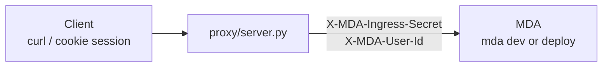

# trusted-backend

A **minimal** Managed Deep Agent that shows how to put an MDA deployment behind
your own API (trusted-backend ingress).

1. Your backend authenticates the user (here: a toy `/login?user=` cookie)
2. It proxies LangGraph traffic and stamps reserved headers
3. The agent’s `whoami` tool echoes the identity MDA resolved for that run

The browser never sees `MDA_INGRESS_SECRET`. Contrast with
[`sandbox-assistant/`](../sandbox-assistant), which uses browser-direct Supabase JWTs.

## How it works



`identity.py` uses the default:

```python
identity = define_identity()  # auth: "backend"
```

## Layout

```text
trusted-backend/
  agent.py           # define_deep_agent + whoami tool
  identity.py        # define_identity() — trusted backend
  instructions.md
  tools/whoami.py    # returns runtime.identity
  proxy/server.py    # toy session + header-stamping proxy
  Makefile           # make dev → agent + proxy
  env.example
```

## Configure

```bash
cd trusted-backend
uv sync
cp env.example .env
# set OPENAI_API_KEY and MDA_INGRESS_SECRET (LANGSMITH_API_KEY only for deploy)
```

Generate any strong random string for `MDA_INGRESS_SECRET` and use the **same**
value for `mda dev` / deploy and for the proxy.

This example path-links the local SDK (`[tool.uv.sources]`), which does **not**
ship the prebuilt `mda` binary. `make dev` / `make deploy` seed it via
`scripts/ensure_mda_binary.py` (from a `uv tool install managed-deepagents`
install or `managed-deepagents-sdk` cargo build).

```bash
uv tool install --prerelease allow managed-deepagents   # if you don't have mda yet
make ensure-mda
```

## Run locally

```bash
make dev
```

That starts two processes in parallel:

- MDA / LangGraph on `http://localhost:2024` (often IPv6 `::1`)
- the trusted-backend proxy on `http://127.0.0.1:4910`

Or run them separately: `make agent` and `make proxy`.

Then authenticate and create a run **through the proxy**:

```bash
# 1. Establish a session as alice
curl -c cookies.txt 'http://127.0.0.1:4910/login?user=alice'

# 2. Create a thread (proxied → MDA with ingress headers)
THREAD=$(curl -s -b cookies.txt -X POST 'http://127.0.0.1:4910/threads' \
  -H 'content-type: application/json' -d '{}')
echo "$THREAD"

# 3. Ask who you are (assistant id = agent name)
THREAD_ID=$(python -c "import json,sys; print(json.loads(sys.argv[1])['thread_id'])" "$THREAD")
curl -s -b cookies.txt -X POST \
  "http://127.0.0.1:4910/threads/${THREAD_ID}/runs/wait" \
  -H 'content-type: application/json' \
  -d '{
    "assistant_id": "trusted-backend",
    "input": { "messages": [{ "role": "user", "content": "Who am I?" }] }
  }' | jq -r '.messages[-1].content'
```

You should see the agent answer as **alice**. Log in as `bob` and repeat — threads
stay scoped per user.

### Raw headers (no proxy)

A real backend does the same stamp without the toy cookie layer:

```bash
curl -s -X POST 'http://localhost:2024/threads' \
  -H 'content-type: application/json' \
  -H "X-MDA-Ingress-Secret: $MDA_INGRESS_SECRET" \
  -H 'X-MDA-User-Id: alice' \
  -d '{}'
```

Never put `MDA_INGRESS_SECRET` in frontend code or client bundles.

## Deploy

```bash
make deploy
# or: Actions → Deploy agent → trusted-backend
```

Point `LANGGRAPH_API_URL` in the proxy (or your production API) at the hosted
deployment URL. Keep `MDA_INGRESS_SECRET` as a deployment secret and only on
server-side config.

## What this demonstrates

- **Trusted-backend identity** — default `define_identity()`
- **Custom backend proxy** — session auth + ingress header stamping
- **Per-user thread scoping** — different `X-MDA-User-Id` values cannot share threads
- **`runtime.identity` in tools** — `whoami` proves the caller's id reached the agent
